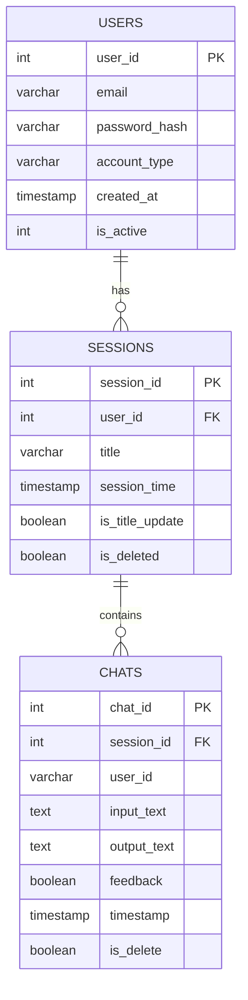

# Database Design




# SQL Code

```sql
CREATE DATABASE IF NOT EXISTS chatbot;

USE chatbot;

CREATE TABLE USERS (
    user_id INT PRIMARY KEY AUTO_INCREMENT,
    email VARCHAR(255) NOT NULL,
    password_hash VARCHAR(255) NOT NULL,
    account_type VARCHAR(50),
    created_at TIMESTAMP DEFAULT CURRENT_TIMESTAMP
);

CREATE TABLE SESSIONS (
    session_id INT PRIMARY KEY AUTO_INCREMENT,
    user_id INT,
    title VARCHAR(255),
    session_time TIMESTAMP DEFAULT CURRENT_TIMESTAMP,
    is_title_update BOOLEAN DEFAULT FALSE,
    is_deleted BOOLEAN DEFAULT FALSE,
    FOREIGN KEY (user_id) REFERENCES USERS(user_id)
);

CREATE TABLE CHATS (
    chat_id INT PRIMARY KEY AUTO_INCREMENT,
    session_id INT,
    user_id INT,
    input_text TEXT,
    output_text TEXT,
    feedback BOOLEAN DEFAULT FALSE,
    timestamp TIMESTAMP DEFAULT CURRENT_TIMESTAMP,
    is_delete BOOLEAN DEFAULT FALSE,
    FOREIGN KEY (session_id) REFERENCES SESSIONS(session_id),
    FOREIGN KEY (user_id) REFERENCES USERS(user_id)
);


INSERT INTO USERS (email, password_hash, account_type) VALUES
('john.doe@example.com', 'hashed_password_1', 'standard'),
('jane.smith@example.com', 'hashed_password_2', 'premium'),
('alice.jones@example.com', 'hashed_password_3', 'standard');


INSERT INTO SESSIONS (user_id, title, session_time, is_title_update, is_deleted) VALUES
(1, 'Session 1', '2024-06-28 10:00:00', FALSE, FALSE),
(2, 'Session 2', '2024-06-28 11:00:00', TRUE, FALSE),
(1, 'Session 3', '2024-06-29 09:00:00', FALSE, TRUE);

INSERT INTO CHATS (session_id, user_id, input_text, output_text, feedback, timestamp, is_delete) VALUES
(1, 1, 'Hello, how can I help you?', 'I need assistance with my account.', TRUE, '2024-06-28 10:01:00', FALSE),
(2, 2, 'What is your query?', 'I want to upgrade my plan.', FALSE, '2024-06-28 11:05:00', FALSE),
(3, 1, 'Can you provide more details?', 'Sure, I am looking for additional features.', TRUE, '2024-06-29 09:10:00', TRUE);

-- When a user Logins, Get use details
SELECT user_id,email,account_type,created_at 
FROM USERS 
WHERE email = 'john.doe@example.com';

-- Get all the session/thread of a user
SELECT session_id,title,session_time 
FROM SESSIONS
WHERE is_deleted = False
ORDER BY session_time DESC;

-- Get all chat from a session / thread
SELECT chat_id,session_id,input_text,output_text,feedback,timestamp 
FROM CHATS
WHERE is_delete = False AND session_id = 1
ORDER BY timestamp ASC;

-- Feedback for a chat
UPDATE CHATS
SET feedback = FALSE
WHERE chat_id = 1;

-- Update Session / Thread Title
UPDATE SESSIONS
SET title = 'New Title' , is_title_update = TRUE
WHERE session_id = 1; 


```