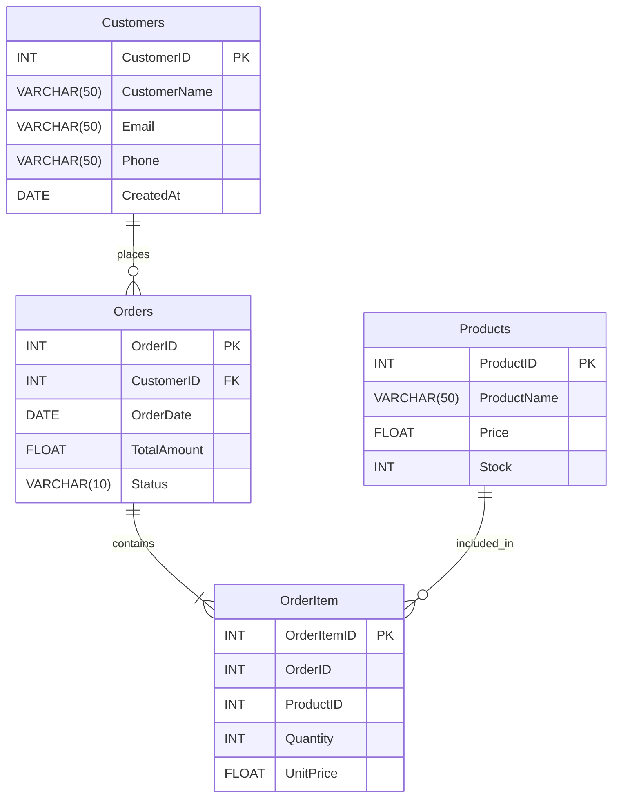

```mermaid
erDiagram
    Customers {
        INT CustomerID PK
        VARCHAR(50) CustomerName
        VARCHAR(50) Email
        VARCHAR(50) Phone
        DATE CreatedAt
    }

    Orders {
        INT OrderID PK
        INT CustomerID FK
        DATE OrderDate
        FLOAT TotalAmount
        VARCHAR(10) Status
    }

    Products {
        INT ProductID PK
        VARCHAR(50) ProductName
        FLOAT Price
        INT Stock
    }

    OrderItem {
        INT OrderItemID PK
        INT OrderID
        INT ProductID
        INT Quantity
        FLOAT UnitPrice
    }

    Customers ||--o{ Orders : places
    Orders ||--|{ OrderItem : contains
    Products ||--o{ OrderItem : included_in
```