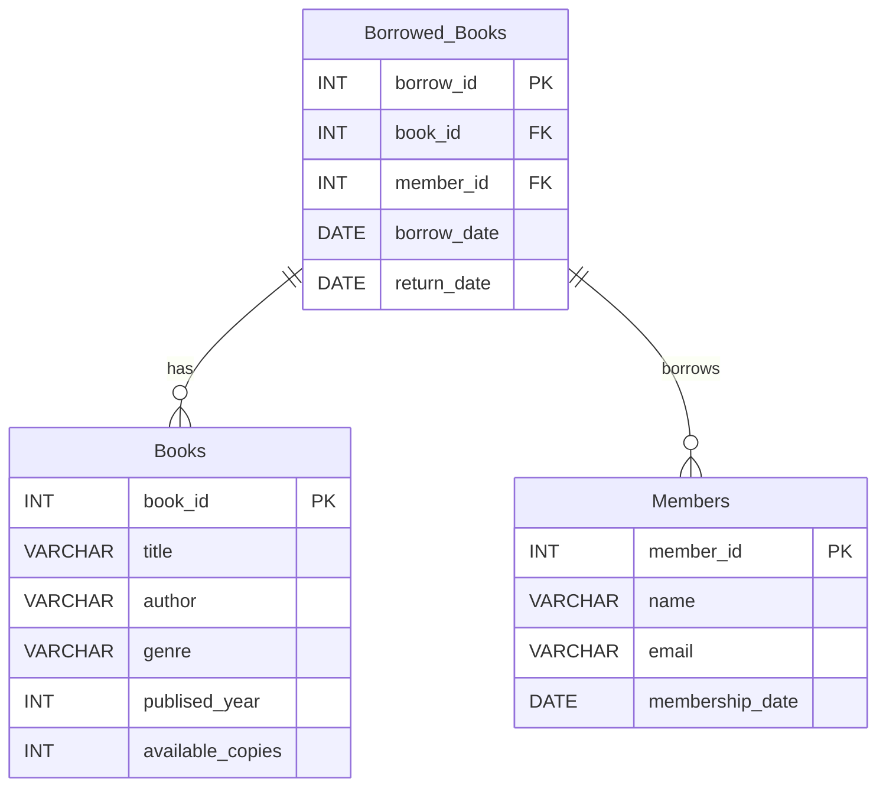

# Library Management System



```sql
CREATE DATABASE IF NOT EXISTS library;
use library;

-- Creating Books Table
CREATE TABLE Books (
    book_id INT PRIMARY KEY,
    title VARCHAR(255),
    author VARCHAR(255),
    genre VARCHAR(100),
    published_year INT,
    available_copies INT
);

-- Inserting Sample Records into Books Table
INSERT INTO Books VALUES
(1, 'The Great Gatsby', 'F. Scott Fitzgerald', 'Fiction', 1925, 5),
(2, 'To Kill a Mockingbird', 'Harper Lee', 'Fiction', 1960, 3),
(3, '1984', 'George Orwell', 'Dystopian', 1949, 4),
(4, 'Moby Dick', 'Herman Melville', 'Adventure', 1851, 2),
(5, 'War and Peace', 'Leo Tolstoy', 'Historical', 1869, 6),
(6, 'The Catcher in the Rye', 'J.D. Salinger', 'Fiction', 1951, 2),
(7, 'The Hobbit', 'J.R.R. Tolkien', 'Fantasy', 1937, 3),
(8, 'Pride and Prejudice', 'Jane Austen', 'Romance', 1813, 5),
(9, 'The Alchemist', 'Paulo Coelho', 'Fiction', 1988, 4),
(10, 'The Odyssey', 'Homer', 'Epic', -700, 1);

-- Creating Members Table
CREATE TABLE Members (
    member_id INT PRIMARY KEY,
    name VARCHAR(255),
    email VARCHAR(255),
    membership_date DATE
);

-- Inserting Sample Records into Members Table
INSERT INTO Members VALUES
(1, 'John Doe', 'john.doe@example.com', '2022-01-15'),
(2, 'Jane Smith', 'jane.smith@example.com', '2022-02-20'),
(3, 'Alice Johnson', 'alice.johnson@example.com', '2023-03-18'),
(4, 'Bob Brown', 'bob.brown@example.com', '2023-04-25'),
(5, 'Charlie Davis', 'charlie.davis@example.com', '2022-05-10'),
(6, 'Diana Miller', 'diana.miller@example.com', '2022-06-30'),
(7, 'Edward Wilson', 'edward.wilson@example.com', '2023-07-12'),
(8, 'Fiona Clark', 'fiona.clark@example.com', '2023-08-05'),
(9, 'George Harris', 'george.harris@example.com', '2023-09-22'),
(10, 'Hannah Martin', 'hannah.martin@example.com', '2023-10-01');

-- Creating Borrowed_Books Table
CREATE TABLE Borrowed_Books (
    borrow_id INT PRIMARY KEY,
    book_id INT,
    member_id INT,
    borrow_date DATE,
    return_date DATE,
    FOREIGN KEY (book_id) REFERENCES Books(book_id),
    FOREIGN KEY (member_id) REFERENCES Members(member_id)
);

-- Inserting Sample Records into Borrowed_Books Table
INSERT INTO Borrowed_Books VALUES
(1, 1, 1, '2023-01-10', '2023-01-20'),
(2, 2, 2, '2023-02-15', '2023-02-25'),
(3, 3, 3, '2023-03-10', '2023-03-20'),
(4, 4, 4, '2023-04-05', '2023-04-15'),
(5, 5, 5, '2023-05-12', '2023-05-22'),
(6, 6, 6, '2023-06-15', '2023-06-25'),
(7, 7, 7, '2023-07-20', '2023-07-30'),
(8, 8, 8, '2023-08-25', '2023-09-04'),
(9, 9, 9, '2023-09-05', '2023-09-15'),
(10, 10, 10, '2023-10-10', '2023-10-20');

```

## Task

**Aggregation / Grouping**

1. How many books are available in each genre?
2. What is the total number of books borrowed by each member?
3. Find the average number of available copies per genre.

**Scalar Functions**

4. Get the uppercase version of all book titles.
5. Find the length of each member's name.
6. Extract the year from the membership_date of all members.

**Pivot Table**

7. Create a pivot table showing the count of books borrowed by each member in each year.

**Filtering and Sorting**

8. List all books published after the year 1950.
9. Find all members who joined in the year 2023.
10. Sort the books by their title in ascending order.
11. List all borrowed books where the return date is NULL.

**Indexes**

12. Create an index on the author column in the Books table.
13. Create an index on the membership_date column in the Members table.

**Joins**

14. Retrieve a list of all borrowed books along with the member who borrowed them.
15. Find all books that have been borrowed by 'John Doe'.
16. Get the total number of books borrowed by each member along with their names.

**Handling Null Values**

17. Find all records in the Borrowed_Books table where the return_date is NULL.
18. Replace NULL values in the return_date column with the current date.

**Triggers**

19. Create a trigger that updates the available_copies in the Books table when a book is borrowed.
20. Create a trigger that sends an email notification when a new member is added to the Members table.