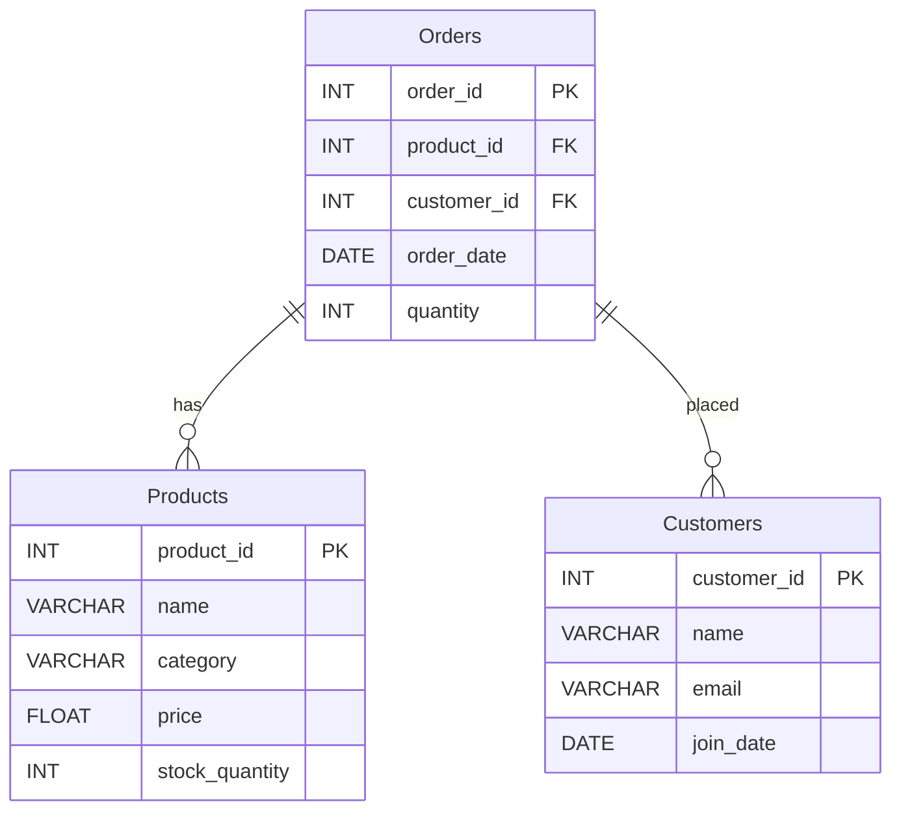

# Online Shopping Platform



```sql
CREATE DATABASE IF NOT EXISTS shopping;
use shopping;

-- Creating Products Table
CREATE TABLE Products (
    product_id INT PRIMARY KEY,
    name VARCHAR(255),
    category VARCHAR(100),
    price DECIMAL(10, 2),
    stock_quantity INT
);

-- Inserting Sample Records into Products Table
INSERT INTO Products VALUES
(1, 'Laptop', 'Electronics', 999.99, 50),
(2, 'Smartphone', 'Electronics', 499.99, 100),
(3, 'Desk', 'Furniture', 150.00, 20),
(4, 'Chair', 'Furniture', 75.00, 30),
(5, 'Book', 'Books', 20.00, 200),
(6, 'Pen', 'Stationery', 2.00, 500),
(7, 'Notebook', 'Stationery', 5.00, 300),
(8, 'Tablet', 'Electronics', 300.00, 75),
(9, 'Monitor', 'Electronics', 200.00, 40),
(10, 'Headphones', 'Electronics', 50.00, 60);

-- Creating Customers Table
CREATE TABLE Customers (
    customer_id INT PRIMARY KEY,
    name VARCHAR(255),
    email VARCHAR(255),
    join_date DATE
);

-- Inserting Sample Records into Customers Table
INSERT INTO Customers VALUES
(1, 'John Doe', 'john.doe@example.com', '2023-01-01'),
(2, 'Jane Smith', 'jane.smith@example.com', '2023-02-15'),
(3, 'Alice Johnson', 'alice.johnson@example.com', '2023-03-10'),
(4, 'Bob Brown', 'bob.brown@example.com', '2023-04-20'),
(5, 'Charlie Davis', 'charlie.davis@example.com', '2023-05-25'),
(6, 'Diana Miller', 'diana.miller@example.com', '2023-06-30'),
(7, 'Edward Wilson', 'edward.wilson@example.com', '2023-07-18'),
(8, 'Fiona Clark', 'fiona.clark@example.com', '2023-08-05'),
(9, 'George Harris', 'george.harris@example.com', '2023-09-22'),
(10, 'Hannah Martin', 'hannah.martin@example.com', '2023-10-01');

-- Creating Orders Table
CREATE TABLE Orders (
    order_id INT PRIMARY KEY,
    product_id INT,
    customer_id INT,
    order_date DATE,
    quantity INT,
    FOREIGN KEY (product_id) REFERENCES Products(product_id),
    FOREIGN KEY (customer_id) REFERENCES Customers(customer_id)
);

-- Inserting Sample Records into Orders Table
INSERT INTO Orders VALUES
(1, 1, 1, '2023-01-10', 1),
(2, 2, 2, '2023-02-20', 2),
(3, 3, 3, '2023-03-15', 1),
(4, 4, 4, '2023-04-25', 4),
(5, 5, 5, '2023-05-30', 3),
(6, 6, 6, '2023-06-15', 10),
(7, 7, 7, '2023-07-25', 5),
(8, 8, 8, '2023-08-20', 2),
(9, 9, 9, '2023-09-05', 1),
(10, 10, 10, '2023-10-10', 3);

```

## Fix the Query to get the desired Output

1. Find all products in the 'Electronics' category.

```sql
SELECT * FROM Products WHERE category = 'electronics';
```
Expected Output: All products in 'Electronics' category.

2. List all customers who joined after '2023-06-01'.
```sql
SELECT * FROM Customers WHERE join_date > '2023-6-1';
```
Expected Output: Customers who joined after June 1, 2023.

3. Retrieve the name and price of all products that cost more than $100.

```sql
SELECT name, cost FROM Products WHERE price > 100;
```
Expected Output: Name and price of products costing more than $100.

4. Count the total number of orders.
```sql
SELECT COUNT(*) AS total_orders FROM Orders WHERE order_id IS NOT NULL;
```

5. Find all orders placed by 'Jane Smith'.
```sql
SELECT * FROM Orders o JOIN Customers c ON o.customer_id = c.customer_id WHERE c.name = 'Jane smith';
```
Expected Output: Orders placed by Jane Smith.

6. List all products with a stock quantity less than 50.

```sql
SELECT * FROM Products WHERE stock_quantity < '50';
```
Expected Output: Products with stock quantity less than 50.

7. Find the customer email for order_id 5.
```sql
SELECT email FROM Customers c JOIN Orders o ON c.customer_id = o.customer_id WHERE order_id = 5;
```
Expected Output: Email of the customer who placed order_id 5.

8. Retrieve the total price for order_id 2 (price * quantity).
```sql
SELECT SUM(p.price * o.quantity) AS total_price FROM Orders o JOIN Products p ON o.product_id = p.product_id WHERE order_id = '2';
```
Expected Output: Total price for order_id 2.

9. List all orders with a quantity of 2 or more.
```sql
SELECT * FROM Orders WHERE quantity => 2;
```
Expected Output: Orders with a quantity of 2 or more.

10. Find the total stock quantity of all products in the 'Stationery' category.
```sql
SELECT SUM(stock_quantity) AS total_stock FROM Products WHERE category = Stationery;
```
Expected Output: Total stock quantity of all 'Stationery' products.

11. Find the average price of products in each category.
```sql
SELECT category, AVG(price) AS average_price FROM Products GROUP BY category HAVING price > 0;
```
Expected Output: Average price of products in each category.

12. List the top 3 most expensive products.
```sql
SELECT * FROM Products ORDER BY price DESC LIMIT 3 OFFSET 1;
```
Expected Output: Top 3 most expensive products.

13. Retrieve the names of customers who placed more than 3 orders.
```sql
SELECT name FROM Customers c JOIN Orders o ON c.customer_id = o.customer_id GROUP BY c.customer_id HAVING COUNT(o.order_id) > 3;
```
Expected Output: Names of customers who placed more than 3 orders.

14. Find the total quantity of products ordered by each customer.
```sql
SELECT customer_id, SUM(quantity) AS total_quantity FROM Orders GROUP BY customer_id;
```
Expected Output: Total quantity of products ordered by each customer.

15. List all products that have not been ordered.
```sql
SELECT * FROM Products p LEFT JOIN Orders o ON p.product_id = o.product_id WHERE order_id = NULL;
```
Expected Output: Products that have not been ordered.

16. Find the number of customers who joined each month in 2023.
```sql
SELECT MONTH(join_date) AS month, COUNT(*) AS num_customers FROM Customers WHERE YEAR(join_date) = 2023 GROUP BY MONTH(join_date);

```
Expected Output: Number of customers who joined each month in 2023.

17. Retrieve the details of the most recent order.
```sql

SELECT * FROM Orders ORDER BY order_date DESC LIMIT 1 OFFSET 0;
```
Expected Output: Details of the most recent order.

18. Find the total revenue (price * quantity) generated by each product.
```sql
SELECT product_id, SUM(price * quantity) AS total_revenue FROM Orders o JOIN Products p ON o.product_id = p.product_id GROUP BY product_id;
```
Expected Output: Total revenue generated by each product.

19. List all customers who have never placed an order.
```sql
SELECT * FROM Customers c LEFT JOIN Orders o ON c.customer_id = o.customer_id WHERE order_id IS NOT NULL;
```
Expected Output: Customers who have never placed any order