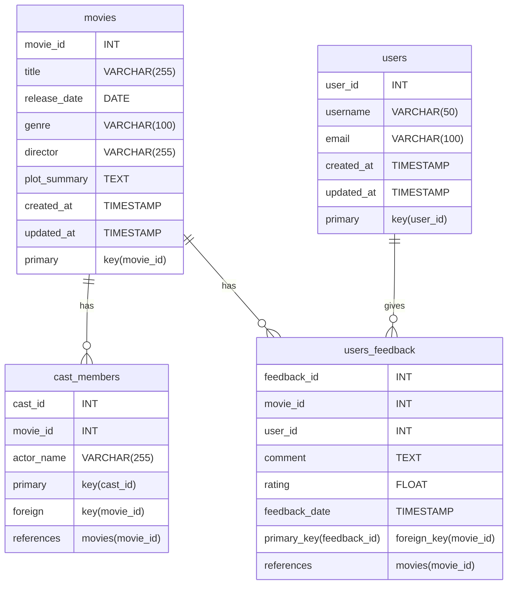

# MySQL Training

```mermaid
erDiagram
    movies {
        movie_id INT
        title VARCHAR(255)
        release_date DATE
        genre VARCHAR(100)
        director VARCHAR(255)
        plot_summary TEXT
        created_at TIMESTAMP
        updated_at TIMESTAMP
        primary key(movie_id)
    }
    
    cast_members {
        cast_id INT
        movie_id INT
        actor_name VARCHAR(255)
        primary key(cast_id)
        foreign key(movie_id) references movies(movie_id)
    }
    
    users_feedback {
        feedback_id INT
        movie_id INT
        user_id INT
        comment TEXT
        rating FLOAT
        feedback_date TIMESTAMP
        primary_key(feedback_id)
        foreign_key(movie_id) references movies(movie_id)
    }
    
    users {
        user_id INT
        username VARCHAR(50)
        email VARCHAR(100)
        created_at TIMESTAMP
        updated_at TIMESTAMP
        primary key(user_id)
    }

    movies ||--o{ cast_members : "has"
    movies ||--o{ users_feedback : "has"
    users ||--o{ users_feedback : "gives"
```
